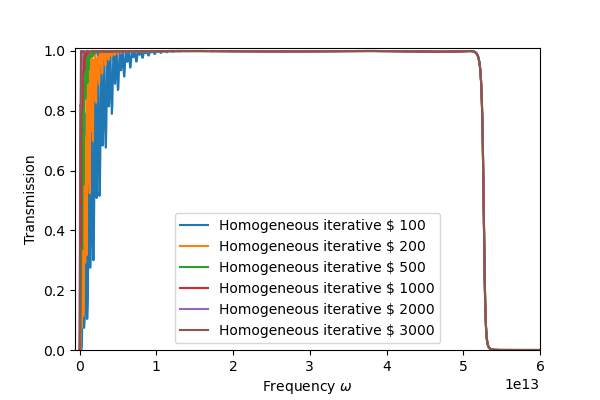

# agf_1d
1D-chain Atomistic Green's Function method
1次元鎖の原子グリーン関数法

Numpy, matplotlib

```Python
agf_homo = AGF_one_d(mc=4.6*1e-26, md=4.6*1e-26, legend="Homogeneous case")
agf_hetero1 = AGF_one_d(mc=4.6*1e-26, md=9.2*1e-26, legend="Heterogeneous case $m_c : m_d = 1 : 2$")
agf_hetero2 = AGF_one_d(mc=4.6*1e-26, md=2.3*1e-26, legend="Heterogeneous case $m_c : m_d = 2 : 1$")

agf_homo.transmission()
agf_hetero1.transmission()
agf_hetero2.transmission()

plot_transmissions([agf_homo,agf_hetero1,agf_hetero2], pic_name="agf_test.png")
```


上は解析的な結果。次はiterativeなsurface green's functionの計算結果。右の数字はiterationの最大値。の表式によって収束性が違うが、絶対値にはそこまで影響しなさそう。




2枚目のlegendはHeteroとなっているが、実際はHomo。について、


であり、の値について1つ目は1e-1、2つ目は1e-3とした。論文では1e-3がよいとされているが、収束性は圧倒的に1e-1がよい。


## 参考

W. Zhang, T.S.Fisher & N.Mingo, "The Atomistic Green's Function Method: An Efficient Simulation Approach for Nanoscale Phonon Transport", Numerical Heat Transfer, Part B: Fundamentals, 51:4, 333-349, 2007.